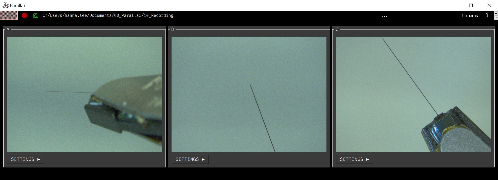

# Parallax



Parallax is a graphical user interface designed to streamline the process of setting up and performing acute *in vivo* electrophysiology experiments.


### Prerequisites
- Python~=3.8 (Recommended to install via [Anaconda](https://www.anaconda.com/products/individual) or [Miniconda](https://docs.conda.io/en/latest/miniconda.html))
- PySpin (for Linux or Mac OS users)


### Installation
1. To install the latest version:
```bash
pip install parallax-app
```
To upgrate to the latest version:
```bash
pip install parallax-app --upgrade
```

2. Create virtual environment and activate it:
- On Windows:
```bash
python -m venv venv
./venv/Scripts/activate
```
- On Linux/Mac:
```bash
python -m venv venv
source venv/bin/activate
```

3. Install Dependencies:
```bash
python -m pip install -e .
```

### Running Parallax
```bash
python -m parallax
```

### Additional Setup for Linux and Mac OS
For Linux or Mac OS, you'll need to install PySpin manually (not required for
Windows):
* download the Spinnaker SDK package for your system from [here](https://flir.app.boxcn.net/v/SpinnakerSDK)
* follow the installation instructions in the README
* Install the Python bindings found alongside the SDK package

### Support and Contribution
If you encounter any issues or would like to contribute to the project, please check out our issues page on GitHub.

### License
Parallax is licensed under the Allen Institute Software License. For more details, see the LICENSE file.
