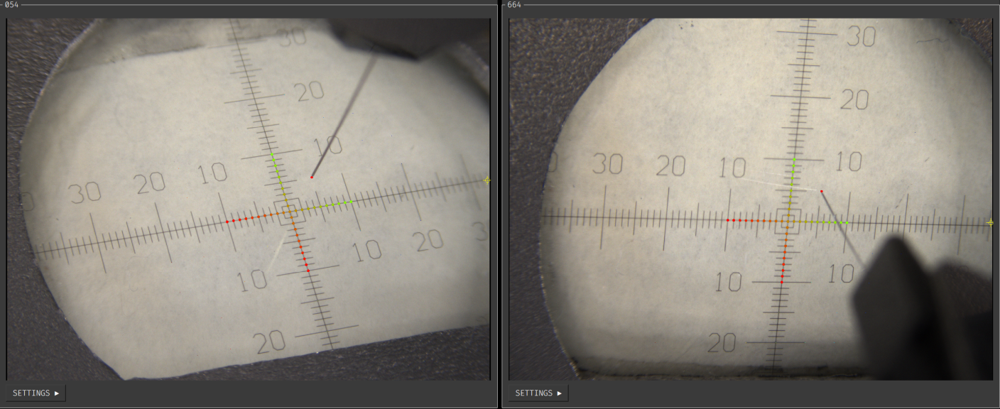

# Parallax



Parallax is a graphical user interface designed to streamline the process of 
setting up and performing acute *in vivo* electrophysiology experiments.

**Documentation**: [parallax.readthedocs.io](https://parallax.readthedocs.io/en/latest/index.html).

## Prerequisites
- **Python 3.10**: Required for compatibility with the Spinnaker library.
- [Spinnaker SDK 4.2](https://www.teledynevisionsolutions.com/products/spinnaker-sdk) and Teledyne FLIR software for camera support.
- We recommend using [`uv`](https://docs.astral.sh/uv/) for environment management.


## Installation
#### 1. Install Parallax
Option A, Install from PyPI:
```bash
uv venv --python 3.10
# On macOS/Linux: source .venv/bin/activate
# On Windows: .venv\Scripts\activate
uv pip install parallax-app
```
Option B, Install via local repository (Recommanded):
```bash
git clone http://github.com/AllenNeuralDynamics/parallax.git
cd parallax
uv sync
```

#### 2. Install Spinnaker
Install the camera interface [Spinnaker SDK 4.2](https://www.teledynevisionsolutions.com/products/spinnaker-sdk)
```bash
# Install from the **wheel file** that comes with the Spinnaker SDK ver.4.2.
# Replace **<WHEEL_PATH>** with the *full path* to your `.whl`:
uv pip install "<WHEEL_PATH>"
# Example) uv pip install spinnaker_python-4.2.0.88-cp310-cp310-win_amd64.whl
```

## Running Parallax
```bash
uv run parallax
```

### Optional: Enable SuperPoint + SuperGlue Reticle Detection
Parallax supports reticle detection using SuperPoint + LightGlue.
To enable reticle detection using SuperPoint + SuperGlue, you must manually download 'SuperGluePretrainedNetwork' pretrained models.

The SuperGluePretrainedNetwork is not included in this repository and is distributed under its own licensing terms.
Please review their [license](https://github.com/magicleap/SuperGluePretrainedNetwork) before use.

Manual Setup Instructions
Clone the repository if it hasn't been done already.
```bash
git clone https://github.com/AllenNeuralDynamics/parallax.git
cd parallax
```
1. Install the required `sfm` dependency from GitHub:
```bash
uv pip install git+<https://github.com/AllenNeuralDynamics/sfm.git@main>
```

2. Clone the repository into the external/ folder in your Parallax project root:
```bash

git clone https://github.com/magicleap/SuperGluePretrainedNetwork.git external/SuperGluePretrainedNetwork
```

3. Verify your folder structure looks like this:
```bash
parallax/
├── external/
│   └── SuperGluePretrainedNetwork/
│       └── models/
│           ├── superpoint.py
│           └── weights/
│               ├── superpoint_v1.pth
│               └── superglue_indoor.pth
```

### For developers:
The following are tools used to ensure code quality in this project.
- Install dependencies:
```bash
uv sync --all-extras
```

- Unit Testing
```bash
uv run pytest tests
```

- Linting
```bash
uv run ruff check
```

- Type Check
```bash
uv run mypy parallax
```

### Documentation
Create the documentation html files, run:
```bash
uv run sphinx-build -b html docs/source docs/_build
```

### Support and Contribution
If you encounter any problems or would like to contribute to the project, 
please submit an [Issue](https://github.com/AllenNeuralDynamics/parallax/issues)
on GitHub.

### License
Parallax is licensed under the MIT License. For more details, see 
the [LICENSE](LICENSE) file.
