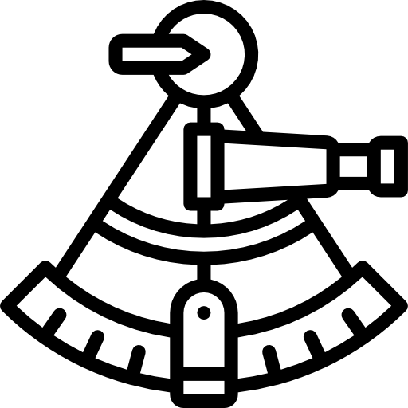
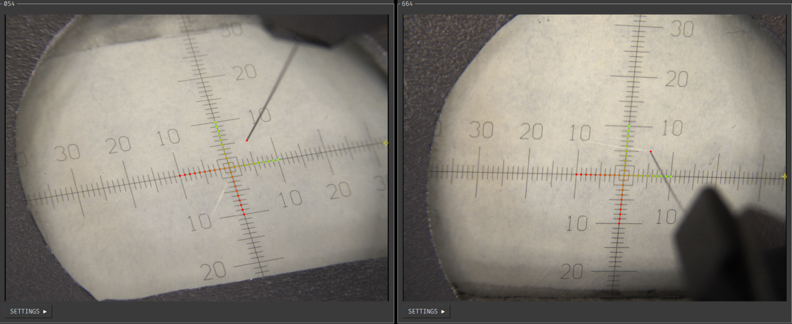
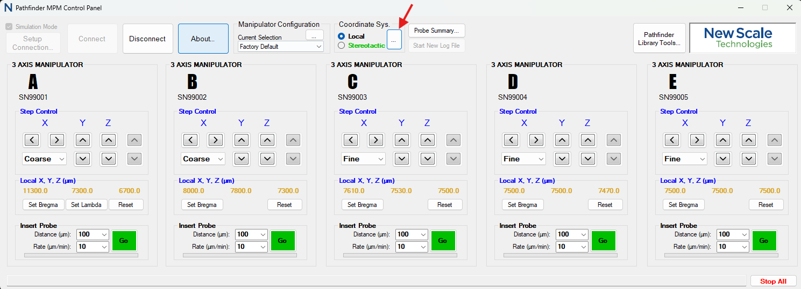
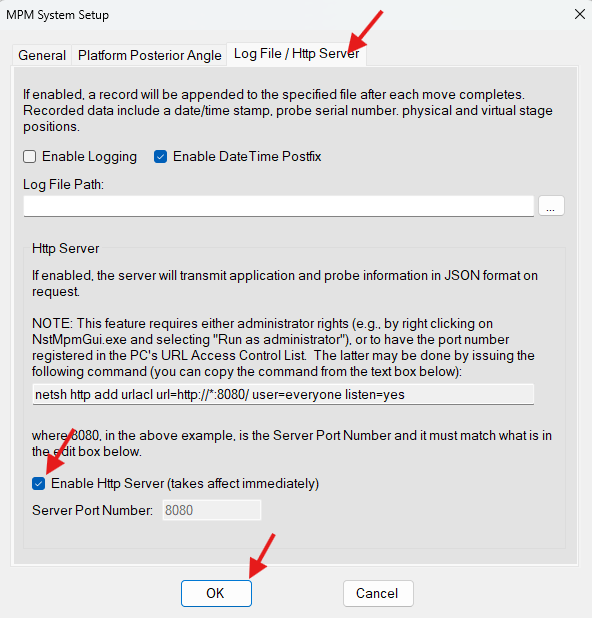

#   Parallax



Parallax is a graphical user interface designed to streamline the process of 
setting up and performing acute *in vivo* electrophysiology experiments.


**Documentation**: [parallax.readthedocs.io](https://parallax.readthedocs.io/en/latest/index.html).


## ⚙️ Prerequisites
- **<font color="blue">Python 3.10</font>**: Required for compatibility with the Spinnaker library.
- For Teledyne FLIR camera, [Spinnaker SDK 4.3 and PySpin](https://www.teledynevisionsolutions.com/support/support-center/software-firmware-downloads/iis/spinnaker-sdk-download/spinnaker-sdk--download-files/) (Teledyne FLIR's [guide](https://www.teledynevisionsolutions.com/support/support-center/technical-guidance/iis/installing-pyspin-for-the-spinnaker-sdk/))
- For Stage control, [Pathfinder MPM Control Panel v.2.8 or later](https://newscaletech.com/multi-probe-micromanipulator/mpm-system-pathfinder-software/)


## 📦 Installation

#### 1. Install Parallax
Option A, Install from PyPI:
```bash
uv venv --python 3.10
# On macOS/Linux: source .venv/bin/activate
# On Windows: .venv\Scripts\activate
uv pip install parallax-app
```

Option B, **Install via local repository (Recommended)**:
```bash
git clone https://github.com/AllenNeuralDynamics/parallax.git
cd parallax
uv sync
```


#### 2. Install  [Pathfinder MPM Control Panel v.2.8 or later](https://newscaletech.com/multi-probe-micromanipulator/mpm-system-pathfinder-software/)
Pathfinder is for controlling stages. Parallax communicates over a local network port.


#### 3. Install Spinnaker
Install the camera interface [Spinnaker SDK 4.3 and PySpin](https://www.teledynevisionsolutions.com/products/spinnaker-sdk)
1. Install the full Spinnaker SDK
2. Install PySpin
    ```bash
    # Install from the **wheel file** that comes with the Spinnaker SDK ver.4.3.
    # Replace **<WHEEL_PATH>** with the *full path* to your `.whl`:
    uv pip install "<WHEEL_PATH>"
    # Example) uv pip install spinnaker_python-4.3.0.190-cp310-cp310-win_amd64.whl
    ```


### Optional: Enable SuperPoint + SuperGlue Reticle Detection
Parallax supports reticle detection using SuperPoint + LightGlue.
To enable reticle detection using SuperPoint + SuperGlue, you must manually download 'SuperGluePretrainedNetwork' pretrained models.

The SuperGluePretrainedNetwork is not included in this repository and is distributed under its own licensing terms.
Please review their [license](https://github.com/magicleap/SuperGluePretrainedNetwork) before use.

#### Manual Setup Instructions
0. Clone the repository if it hasn't been done already.
    ```bash
    git clone https://github.com/AllenNeuralDynamics/parallax.git
    cd parallax
    ```
1. Install the required `sfm` dependency from GitHub:
    ```bash
    uv pip install git+https://github.com/AllenNeuralDynamics/sfm.git@main
    ```

2. Clone the repository into the external/ folder in your Parallax project root:
    ```bash
    git clone https://github.com/magicleap/SuperGluePretrainedNetwork.git external/SuperGluePretrainedNetwork
    ```

3. Verify your folder structure looks like this:
    ```bash
    parallax/
    ├── external/
    │   └── SuperGluePretrainedNetwork/
    │       └── models/
    │           ├── superpoint.py
    │           └── weights/
    │               ├── superpoint_v1.pth
    │               └── superglue_indoor.pth
    ```


## 🚀 Running Parallax
1. **Stage Connection Setup:**
   
   1. Run the Pathfinder MPM Control Software as an administrator to connect the stage.
   2. Once connected, navigate to **MPM System Setup**.

        

   3. On the setup page, go to the **LogFile/Http Server** tab and enable the HTTP server.

        

2. **Then run Parallax:**
    ```bash
    uv run parallax
    ```

## 🎮 How to Use (Short Description)

#### 0. Prerequisites
* Ensure the camera can clearly see the reticle surface without glare. 
* Adjust the camera to focus exactly on the reticle's (0,0,0) position.

#### 1. Reticle Calibration
* Click the **Reticle Detect** button. You can choose either **OpenCV** (uses Hough line detection and morphology) or **SuperPoint** (uses CNN models like SuperPoint and LightGlue). Use whichever algorithm works best for your setup.
* After detection, verify that the detected lines align perfectly with the actual reticle lines and that the points fall exactly on the tick marks. 
* Click **Triangulation** and select the positive-x axis for your system.
* The system will perform triangulation. A reprojection error of under 5.0 µm³ is acceptable.

#### 2. Probe Calibration
* After completing reticle calibration, click the **Probe Detect** button. 
    * **OpenCV** works for a 1-shank probe.
    * **YOLO** supports both 1-shank and 4-shank probes. 
    * *Note for 4 shanks:* The camera must be able to clearly see all 4 shanks. If the camera angle prevents this, adjust the camera location and restart the calibration from the beginning.
* Move the probe tip close to the reticle surface to ensure better focus and precision.
* Move the probe into each of the four quadrants. Pause briefly in each quadrant before moving to the next to allow the system to gather positional information for computation.

**For more details, please see the full documentation:** [parallax.readthedocs.io](https://parallax.readthedocs.io/en/latest/index.html)


## 🛠️ For developers:
The following are tools used to ensure code quality in this project.
- Install dependencies:
    ```bash
    uv sync --all-extras
    ```

- Unit Testing
    ```bash
    uv run pytest tests
    ```

- Linting
    ```bash
    uv run ruff check
    ```

- Format
    ```bash
    uv run ruff format --check parallax
    ```

- Type Check
    ```bash
    uv run mypy parallax
    ```


## 📖 Documentation
Create the documentation html files, run:
```bash
uv run sphinx-build -b html docs/source docs/_build
```

## 🤝 Support and Contribution
If you encounter any problems or would like to contribute to the project, 
please submit an [Issue](https://github.com/AllenNeuralDynamics/parallax/issues)
on GitHub.

## 📄 License
Parallax is licensed under the MIT License. For more details, see 
the [LICENSE](LICENSE) file.
