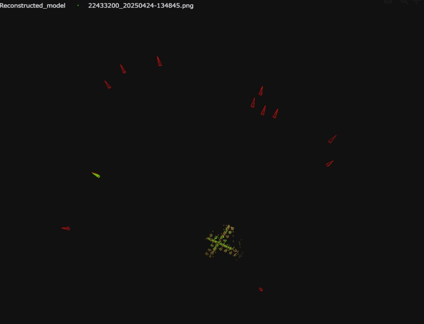

*Programmer's Guide*

Reticle Detection (CNN)
-----------------------

**Overview**

The CNN-based reticle detection leverages a Structure-from-Motion (SfM) pipeline to estimate the 6-Degrees-of-Freedom (6-DoF) pose of a camera. This is achieved by comparing a query image against a pre-built database of reticle images with known camera poses and intrinsics.

In the visualization:

- **Red** frustums represent camera poses in the database.
- **Yellow** points represent the 3D reticle points in the database.
- **Green** frustum shows the pose of the querying camera, with lines indicating covisible reticle points.

**The Pipeline**

The process involves several key stages:

1.  **Database (Offline SfM)**
    The system uses a pre-built reference database of reticle images. An offline Structure-from-Motion process, typically using COLMAP, constructs a 3D point cloud of the reticle and determines the precise extrinsic (rotation and translation) and intrinsic (focal length, optical center) parameters for each image in the database.

2.  **Feature Extraction**
    For a new query image, the pipeline employs **SuperPoint**, a deep learning-based feature detector, to extract robust keypoints and their corresponding descriptors. The high-contrast patterns of the reticle serve as reliable anchor points for feature extraction.

3.  **Feature Matching**
    The features from the query image are matched against the features of the images in the database using **SuperGlue** or **LightGlue**. These matchers, based on graph neural networks, are highly effective at finding correct correspondences, even in the presence of repetitive structures or variations in lighting.

4.  **Camera Localization (Online PnP)**
    With the established 2D-to-3D correspondences (linking 2D keypoints in the query image to the 3D points in the SfM map), a Perspective-n-Point (PnP) algorithm, often combined with RANSAC for outlier rejection, is used. This step calculates the precise rotation (as a quaternion) and translation vectors of the query camera relative to the coordinate system of the reticle map.

**Visual Example**

Here is a visual walkthrough of the SfM pipeline:

1.  **Database Construction**:
    The process begins by capturing multiple images of the reticle from various viewpoints. These images form the basis of the 3D reconstruction.

    .. image:: _static/_progGuide/_reticleDetect/_4_cnn/reticle_img.jpg
        :width: 300px
        :alt: Reticle images from multiple viewpoints

2.  **3D Point Cloud Generation**:
    Using the collected images, an offline SfM process reconstructs a detailed 3D point cloud of the reticle. This point cloud acts as the reference map for camera localization.

    .. image:: _static/_progGuide/_reticleDetect/_4_cnn/reticle_db.jpg
        :width: 300px
        :alt: Reconstructed 3D point cloud of the reticle

3.  **Querying with a New Image**:
    When a new image of the reticle is captured, it is used as a query to determine the camera's current pose.

    .. image:: _static/_progGuide/_reticleDetect/_4_cnn/example_query_img.jpg
        :width: 300px
        :alt: A new query image of the reticle

4.  **Pose Estimation**:
    The system extracts features from the query image and matches them against the 3D point cloud. Through the PnP algorithm, it accurately calculates the 6-DoF pose (position and orientation) of the camera. The final output is the precise location of the camera relative to the reconstructed reticle, as visualized in the overview diagram at the top of this page.

    .. image:: _static/_progGuide/_reticleDetect/_4_cnn/example_query.jpg
        :width: 300px
        :alt: Camera pose estimation using the query image

**Additional Resources**

This implementation builds upon several state-of-the-art open-source projects. For more detailed information on the underlying algorithms and tools, please refer to the following resources:

- **SfM Pipeline (`sfm`)**: The core Structure-from-Motion framework used for database construction and camera localization.
  - `sfm GitHub Repository <https://github.com/AllenNeuralDynamics/sfm>`_

- **Hierarchical Localization (`hloc`)**: The foundational library for the visual localization pipeline.
  - `hloc GitHub Repository <https://github.com/cvg/Hierarchical-Localization>`_

- **SuperPoint**: The deep-learning model for feature point detection and description.
  - `SuperPoint GitHub Repository <https://github.com/rpautrat/SuperPoint>`_

- **LightGlue**: The deep-learning model for feature matching.
  - `LightGlue GitHub Repository <https://github.com/cvg/LightGlue>`_