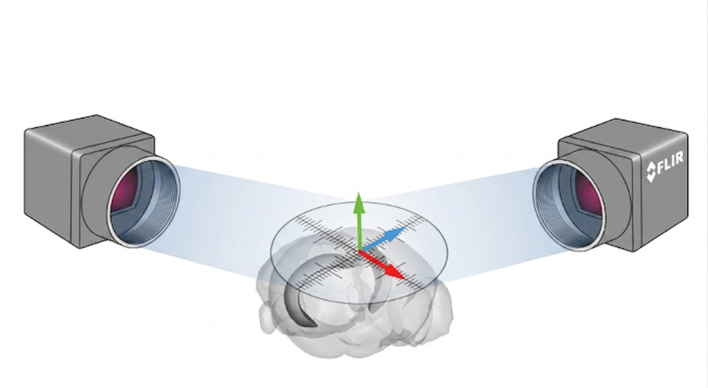
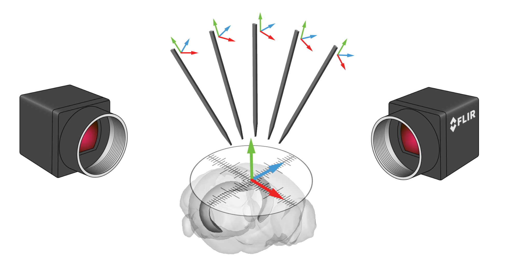
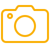
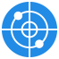
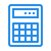
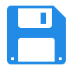
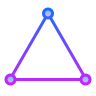
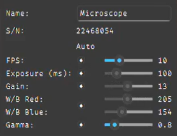

User Guide
====================
.. raw:: html

   

      <iframe width="560" height="315" src="https://www.youtube.com/embed/lYotKVTJtmQ" title="YouTube video player" frameborder="0" allow="accelerometer; autoplay; clipboard-write; encrypted-media; gyroscope; picture-in-picture" allowfullscreen></iframe>
   

Overview
--------

Parallax provides a camera view system that offers controls for camera parameters like framerate and auto-adjustment, along with snapshot and recording capabilities.

The :doc:`Reticle Calibration <userGuideReticleCalib>` workflow is used to determine the camera pose. To calculate the cameras' 3D positions through triangulation, their on-screen coordinates must first be found by the reticle detection function across at least two cameras. For deeper technical insights into the underlying algorithms driving this, refer to the :doc:`Reticle Detection (CNN) <programmersGuideReticleCNN>` and :doc:`Reticle Detection (CV) <programmersGuideReticleCV>` programmer's guides.

Next, the probe tip is located using visual detection and triangulation to determine its position in 3D space. After gathering a few points across multiple camera views, the system calculates the transformation matrix—specifically the rotation and translation—between the manipulator stage's coordinate system and the reticle's coordinate system. The specific methods driving this tracking are detailed in the :doc:`Probe Detection (CNN) <programmersGuideProbeCNN>` and :doc:`Probe Detection (CV) <programmersGuideProbeCV>` documentation. Once calibration is complete, the system can display the probe tip's global coordinates relative to the calibrated reticle position.

User Interface Tour
-------------------

The Parallax interface is divided into several key areas designed to give you flexible control over your experiment. The top row buttons serve as quick-access controls for primary workflows and are categorized by color:

Camera Controls
~~~~~~~~~~~~~~~~~~~~~~~~~~~~~~
These icons control the visual feed, capture, and file management for your cameras.

* |play_icon| / |pause_icon| **Play / Pause:** Start or stop the live camera feed.
* |snapshot_icon| **Snapshot:** Capture a screenshot of the current camera view.
* |record_icon| **Record:** Start or stop a video recording of the camera view.
* |folder_icon| **Output Folder:** Assign the directory where your snapshots and video recordings will be saved.

Stage Controls
~~~~~~~~~~~~~~~~~~~~~~~~~~~~~~
These icons manage coordinate systems, spatial planning, and hardware communication.

* |mpm_icon| **MPM Server:** Set up and connect to the New Scale server address.
* |calc_icon| **Calculate Trajectory:** Open the calculator to convert coordinates between the stage's system, the reticle's system, and Bregma's coordinate system.
* |map_icon| **3D Map:** Visualize the trajectory used to calculate the transformation matrix between the manipulator stage's coordinate system and the reticle's coordinate system.
* |save_icon| **Save Workspace:** Save the stage's current location across all coordinate systems.

Reticle Calibration & Triangulation
~~~~~~~~~~~~~~~~~~~~~~~~~~~~~~~~~~~~~~~~~~~~
These icons are used for multi-camera mathematical alignment.

* |triangle_icon| **Triangulate:** Determine camera poses using 3D triangulation across multiple views.
* |reticle_icon| **Reticle Detection:** Manage your reticle metadata. For detailed instructions, refer to the :doc:`Reticle Metadata <userGuideReticleMetadata>` guide.

.. Define icon substitutions below

Camera Views
~~~~~~~~~~~~

The main workspace displays the live video feeds from your connected cameras.

* **Rearranging the Camera UI:** You can customize your workspace by opening or closing camera views directly from the connected camera list and dragging them to reorganize the layout. Navigation within the view frame is controlled via the mouse:
  
  * **Zoom In/Out:** Scroll the middle mouse button.
  * **Reset Zoom:** Click the middle mouse button to return to the original default zoom level.

  .. image:: _static/_userGuide/_userGuide/cam_org.gif
     :alt: Animation demonstrating how to reorganize camera views and use mouse controls for zooming.
     :align: center

Camera Settings
---------------

Each camera view includes an individual settings panel allowing you to optimize the image for precise tracking and clear visibility.

* **FPS:** Frames per second. Determines how many images the camera captures each second.
* **Exposure (ms):** Adjusts how long the camera sensor is exposed to light per frame. Increasing exposure brightens the image but can reduce your maximum framerate or cause motion blur if the probe is moving quickly.
* **Gain:** Digitally amplifies the camera's signal to artificially brighten the image, though higher gain may introduce digital noise.
* **W/B Red & W/B Blue:** Adjusts the white balance for the red and blue color channels.
* **Gamma:** Adjusts the brightness of the mid-level tones in the image without significantly affecting shadows or highlights.

**Manual vs. Auto Mode**

Under the "Auto" column, the diamond-shaped toggles allow you to switch individual settings between manual and automated modes:

* **Manual Mode (Blue Slider):** When the toggle is disabled, the parameter is fixed to the value you select on the slider.
* **Auto Mode (Grey Slider):** When the toggle is enabled, the software automatically manages the parameter based on environmental conditions.

**Example Configuration:**
In the reference image above, **FPS** is manually set to 10, while **Exposure** and **Gain** are toggled into automated mode. In this state, if the lighting conditions in the room change, the software will automatically adjust the Gain first, and then the Exposure to compensate for the light differences (up to a maximum exposure limit of 100ms), all while keeping the framerate strictly locked at 10 FPS.

.. toctree::
   :maxdepth: 1

   userGuideReticleCalib
   userGuideProbeCalib
   userGuideTrajectory
   userGuideReticleMetadata
   userGuideCalc
   userGuidePtProject