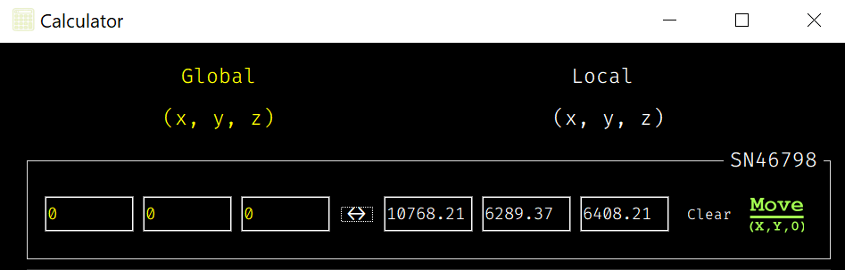

*User Guide*

Calculator
------------

The `Calculator` widget allows you to convert between global and local coordinates 
for different stages. It also helps you manage stage movements and view global 
coordinates with reticle metadata.

----

1. **Coordinate Conversion**

The `Calculator` enables you to convert between **global** and **local** 
coordinates for each stage. Based on whether global or local coordinates 
are provided, the calculator determines the direction of the transformation:

    - **Global to Local**: Input global coordinates (X, Y, Z) and click the "Convert (↔)" button to see the corresponding local coordinates.

    .. raw:: html

        

            

                

                    
                

            

             
            
→

             
            

                

                    
                

            

        

         

    - **Local to Global**: Input local coordinates (X, Y, Z) and click the "Convert (↔)" button to see the corresponding global coordinates.

    .. raw:: html

        

            

                

                    
                

            

             
            
→

             
            

                

                    
                

            

        

         

----

2. **Selecting a Reticle**

If a reticle is selected, the calculator will automatically apply 
reticle-specific metadata to the global coordinates during the conversion.

    You can select a reticle from the **Global Coords** dropdown. If a reticle 
    is selected, its metadata (like offsets and rotations) will be applied to 
    any global coordinates, ensuring that your conversions account for the 
    reticle's alignment.

    - **'Global coords' Selected**: The calculator will convert coordinates without applying any reticle adjustments.
    - **'Global coords (_reticle_name_)' Selected**: The selected reticle's metadata, including rotation and offset, will be applied during conversions.

    .. raw:: html

        

            

                

                    
                

                
→

                

                    
                

            

        

         

----

3. **Stage Movement**

After converting coordinates, you can move the stage to the desired local coordinates. 

    The `moveStageXY0` button allows you to send the stage to a specific (X, Y, 0) position, which is the highest position.

    First, it moves to z = 0 (the highest height), and then it moves to the desired (X, Y) position to avoid collisions with the reticle surface.
    
    .. image:: _static/_userGuide/_calc/_10.png
        :alt: Calculator Overview
        :width: 500px
        :align: center
