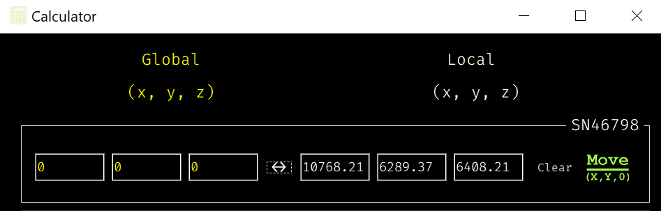

Calculator
============

The ``Calculator`` widget is a utility for converting coordinates between the global (reticle) and local (stage) reference frames. It also allows you to command stage movements based on calculated coordinates and apply reticle metadata for adjusted conversions.

----

1. **Global <-> Local Conversion**

The ``Calculator`` enables you to convert between **global** and **local**
coordinates for each stage. The calculator automatically determines the conversion direction based on which fields are filled.

    - **Global to Local**: Input global coordinates (X, Y, Z) and click the **Convert (↔)** button to see the corresponding local coordinates.

    .. raw:: html

        

            

                

                    
                

            

             
            
→

             
            

                

                    
                

            

        

         

    - **Local to Global**: Input local coordinates (X, Y, Z) and click the **Convert (↔)** button to see the corresponding global coordinates.

    .. raw:: html

        

            

                

                    
                

            

             
            
→

             
            

                

                    
                

            

        

         

----

2. **Bregma <-> Local Conversion**

You can apply a reticle profile's offsets and rotation during conversion by selecting it from the dropdown menu.

    - **Global Coords**: Converts coordinates without applying any reticle adjustments.
    - **Global Coords (*reticle_name*)**: Applies the selected reticle profile's metadata (rotation and offset) during the conversion, which is bregma-aligned.
    

    This ensures that your conversions account for any minor misalignments of the physical reticle.

    .. raw:: html

        

            

                

                    
                

                
→

                

                    
                

            

        

         

----

3. **Stage Movement**

After converting coordinates to a local target, you can command the stage to move to that position.

The ``Move Stage (XY, 0)`` button provides a safe way to move the stage. It first moves the probe to its highest Z position (Z=0) before moving to the target X and Y coordinates. This two-step movement prevents accidental collisions with the reticle or sample.

    .. image:: _static/_userGuide/_calc/_10.png
        :alt: Calculator Overview
        :width: 500px
        :align: center
