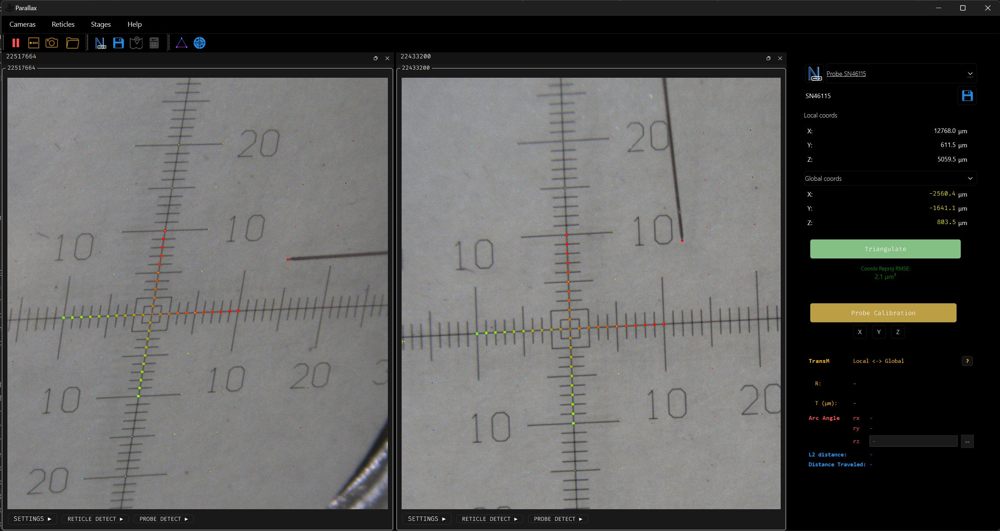
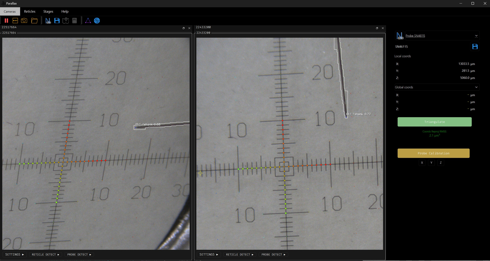
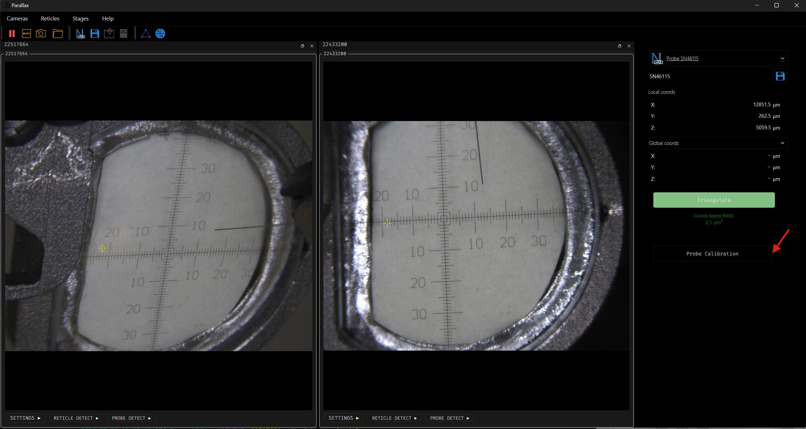
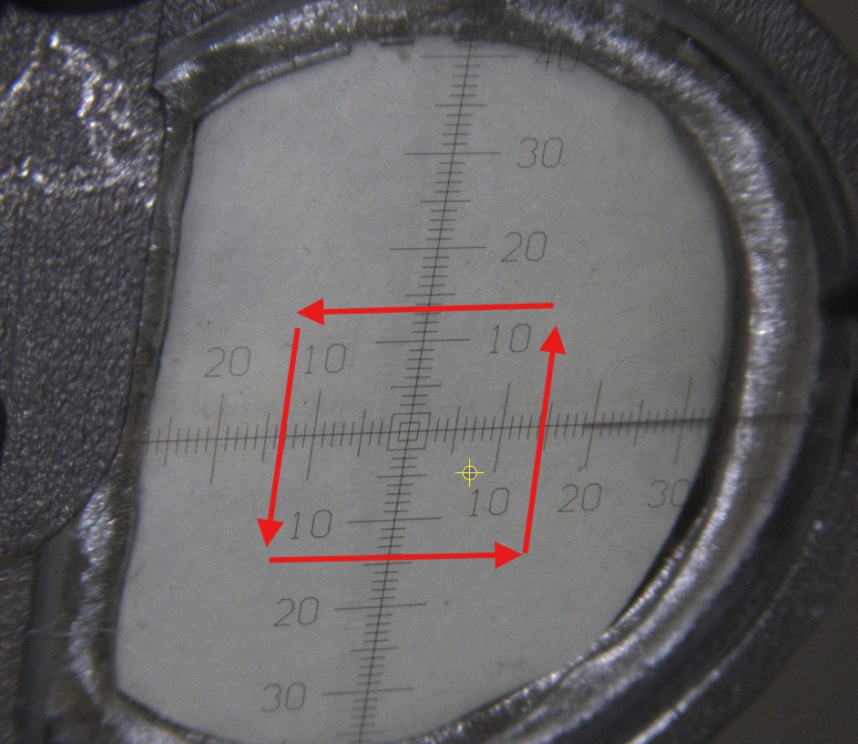
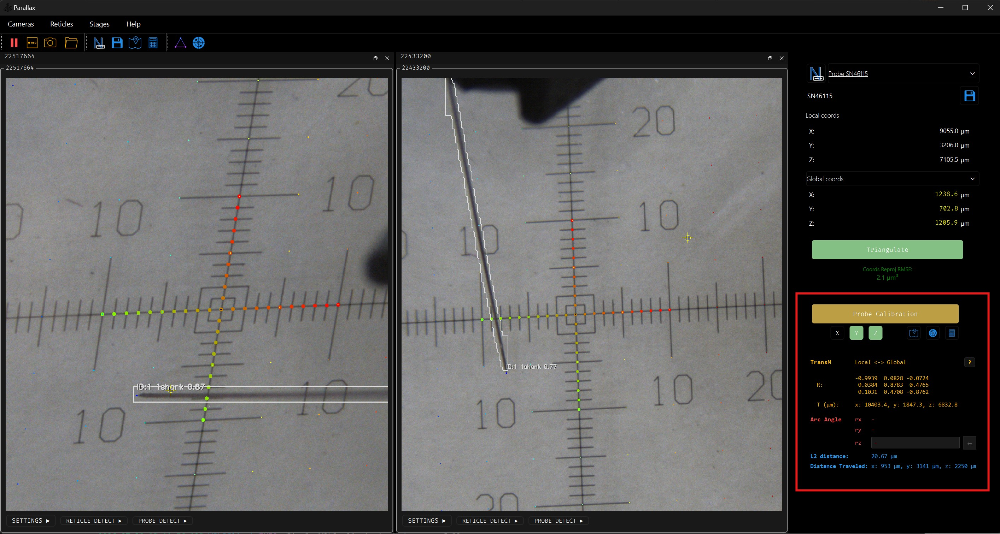
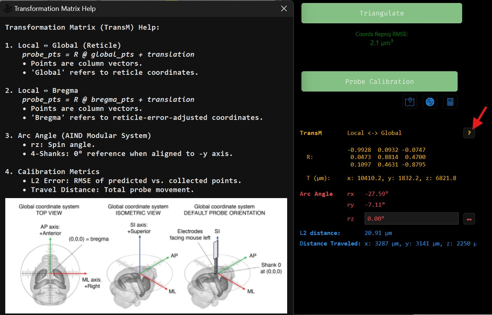

Probe Calibration
------------------

**Setup**

**Select the Stage**: After reticle calibration is complete, select the stage you wish to calibrate from the dropdown menu.

    .. image:: _static/_userGuide/_calib/probe_select.jpg
        :alt: Select a probe for calibration

**Position the Probe:** Move the probe tip close to the reticle surface.

.. tip::
   Since the camera focus is set on the reticle, bringing the probe tip nearby ensures it is also in sharp focus, which significantly improves the precision of tip detection. Ideally, position the probe tip within a **300 µm to 1,000 µm** range from the reticle surface.

**1. Start Calibration**

Under the **PROBE DETECT** menu, you will be presented with two detection algorithms:

*   **OpenCV**: Detects single-shank probes.
*   **YOLO**: Detects both single-shank and 4-shank probes.

   OpenCV algorithm option.

   YOLO algorithm option.

.. note::
    For 4-shank probes, the camera must have a clear, unobstructed view of all four shanks. If the camera angle prevents this (e.g., if the shanks are aligned in a row from the camera's perspective), you must adjust the camera position or select a different pair of cameras for calibration.

After selecting an algorithm (YOLO is the default), click the :blue:`Probe Calibration` button to begin.

**2. Perform Calibration Movements**

To calibrate, you must move the probe so the system can collect data points.

*   **How it Works**: Calibration data is only collected when the probe is **stationary**.

    -   When the probe is moving, the system tracks the tip but does not record its position for calibration.
    -   When the probe stops, the system records the detected tip location as a calibration point.
    -   You must stop the probe multiple times to gather enough data.

*   **Movement Goals**:

    -   Travel at least **2 mm** along each axis (X, Y, and Z). The axis indicator will update when this is achieved.
    -   Collect points in all four quadrants of the workspace. Aim for at least two points per quadrant.

.. tip::
    **Guided Probe Detection**: If one screen detects the probe tip but another does not, you can use the **guided detection** feature. Click near the probe tip on the screen where it failed, and the system will attempt to find the precise tip location. This point will then be collected for calibration.

    .. image:: _static/_userGuide/_calib/probe_calib_guided.jpg
        :alt: Guided probe detection
        :scale: 20%

.. note::
    Even after all axes turn green, collecting additional points can improve the accuracy of the calibration fit.

**3. Review Progress**

As you collect points, the **Probe Info** panel on the right updates with the estimated transformation matrix (R and t), arc angle, L2 distance error, and total traveled distance.

**4. Review Results**

After a successful calibration, the :blue:`Probe Calibration` button will turn green, and the global coordinates will display the probe tip's location relative to the reticle's coordinate system.

.. tip::
    Click the **'?'** button in the **Probe Info** panel to view detailed information about the coordinate systems.

**5. Verify Accuracy (Sanity Check)**

To perform a sanity check on the calibration:

*   **Target the Center**: Move the probe tip to the center of the reticle. The global coordinates should read close to (0, 0, 0).

    .. image:: _static/_userGuide/_calib/probe_target_center.jpg
        :alt: Verifying accuracy by targeting the reticle center

.. tip::
    **Use the Calculator**: The calculator function can show you the stage's position relative to the global or Bregma coordinate systems. You can also command the probe to move to a specific location to verify the transformation, which is often easier than moving it manually. See the calculator page for more details.

**6. Repeat for Other Probes**

Repeat steps 1-5 for any other probes that need calibration.