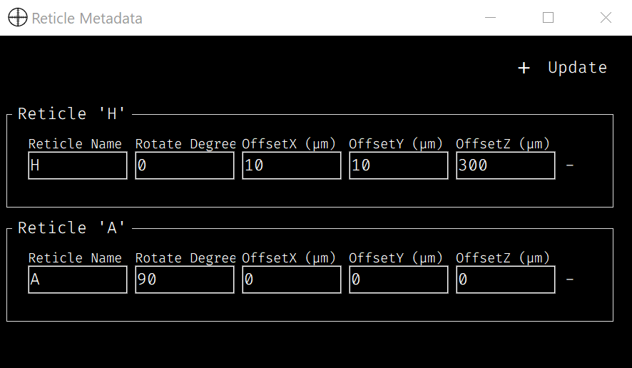
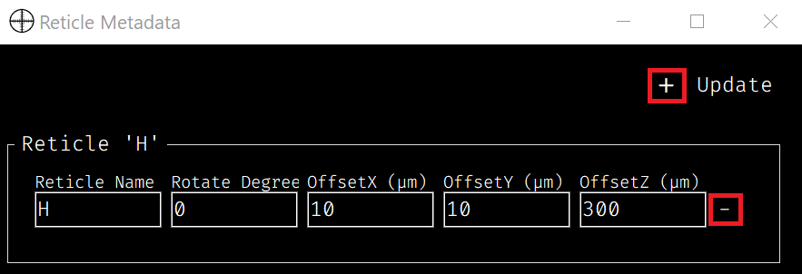
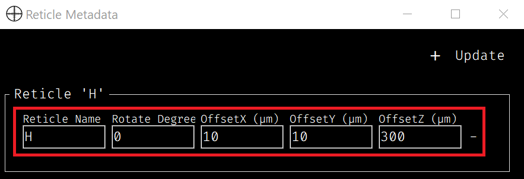
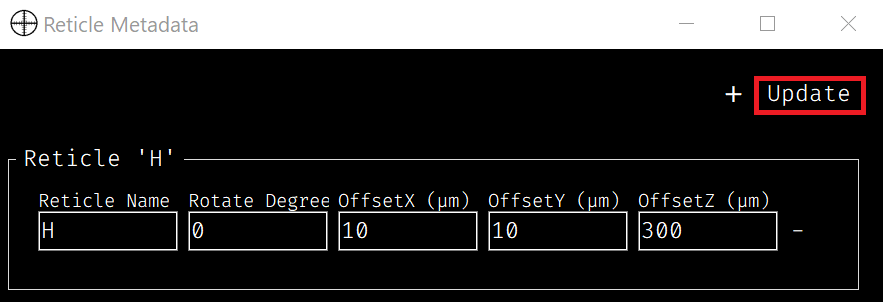
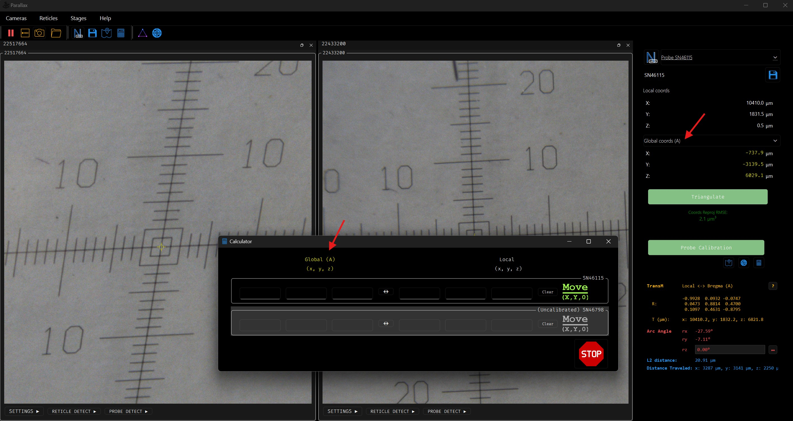
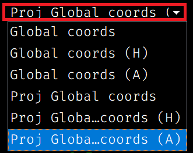

Reticle Metadata
================

.. note::
   **Optional Feature:** Configuring reticle metadata is entirely optional. This process requires precise physical measurements of each individual reticle to determine its specific offsets and rotation, which may not always be available. If you do not have these exact measurements, you can safely skip this configuration.

The ``ReticleMetadata`` widget provides an interface for managing reticle profiles. It allows you to add, update, and remove profiles, each containing transformations (rotation and offsets) that can be applied to the global coordinate system.

This tool is useful for correcting minor inaccuracies in the physical reticle's alignment. You can adjust for these errors by applying a rotation and offsets, ensuring the virtual reticle is accurately aligned with anatomical landmarks.

- **Rotation** (CCW, degrees): Adjust the rotation to correct any misalignment.
- **Offsets (X, Y, Z)**: Adjust the X, Y, and Z values to properly align the reticle with your target.

.. note::
   The process of attaching the reticle glass to its metal frame can introduce small alignment errors. The ``ReticleMetadata`` widget helps correct these imprecisions. For example, if the reticle's origin (0,0,0) does not perfectly match an anatomical landmark like the bregma, you can use the offset and rotation values to align it accurately.

----

Features Overview
-----------------

1. **Add / Remove Reticle Profiles**: Easily create new profiles or remove existing ones.

2. **Edit Metadata**: Update a profile's metadata, including its name, rotation, and offsets.
   
   - **Name**: Edit the name of the reticle (default is a letter like A, B, or C).
   - **Rotation**: Set the rotation value (in degrees) to adjust the reticle’s orientation.
   - **Offsets (X, Y, Z)**: Enter offset values to adjust the reticle's position in 3D space.

3. **Update**: Changes are saved to a JSON file and automatically applied in other parts of the application, such as the Calculator and 3D Point Projection.

4. **Saving and Loading**:
   
   - The widget automatically saves metadata to a JSON file upon update. When reopened, it reloads the saved data, restoring all reticle profiles.

.. note::
   The metadata is saved as ``reticle_metadata.json`` in the UI directory.

----

Example Use Cases
-----------------

If you create and update profiles for reticles 'A' and 'H' as shown below, the system can apply these transformations to the global coordinates.

If the original global coordinates are (2000, 0, 0) (left image), you can use the 'Global Coords' dropdown to select a reticle profile. The displayed coordinates will update to reflect that profile's offsets and rotation.

The example below shows the effect of selecting the 'H' profile.

.. raw:: html

    

        

            

                
                
Original Global Coordinates

            

            
→

            

                
                
Global Coordinates with 'H' Profile

            

        

    

     

In another example, the image below shows the 'A' profile applied, which includes a 90-degree counter-clockwise rotation.

.. raw:: html

    

        

            

                
                
Original Global Coordinates

            

            
→

            

                
                
Global Coordinates with 'A' Profile

            

        

    

     

These reticle profiles are also used by the Calculator and 3D Point Projection tools.

- **Calculator**: In the Calculator, you can convert stage coordinates to global coordinates that account for a specific reticle profile. Simply select the desired profile from the dropdown menu, and the tool will apply the corresponding offsets and rotation. For more details, see the *Calculator* section.

- **3D Point Projection**: For 3D Point Projection, selecting a 'Proj Global Coords (reticle name)' option from the dropdown menu allows you to project a clicked point in the camera view into 3D space, adjusted by the selected reticle profile. For more details, see the *3D Point Projection* section.

