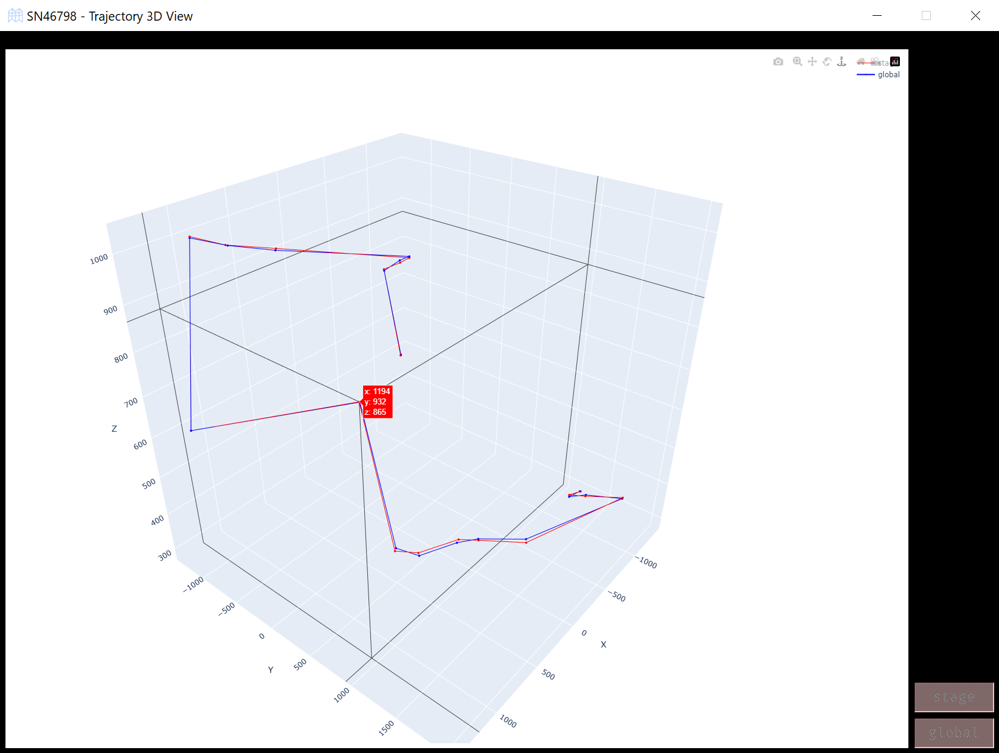

*User Guide*

Probe Calibration Trajectory
------------------------------

The ``PointMesh`` widget provides an interactive 3D visualization of point trajectories during and after calibration. It allows you to compare local and global point trajectories, making it easier to assess the accuracy of the calibration process.

1. **Overview**

    - **Trajectory Visualization**: The widget displays both local and global trajectories for easy comparison. The local points are transformed using a transformation matrix, while the global points represent the final target positions.
    
    - **Interactive Interface**: You can click buttons to toggle the display of different sets of points, including the local and global trajectories, and view how the points move in 3D space.

2. **Using the Widget**

    - **During Calibration**: While calibration is ongoing, the local point trajectory will change as the system applies transformation matrices to map local points to the global coordinate system. As you interact with the buttons, you can visualize both local (stage) and global points in the 3D plot.
    
    .. image:: _static/_userGuide/_traj/_1.png
        :alt: During Calibration
        :width: 200px
        :align: center

    - **After Calibration**: Once calibration is complete, the local points should closely match the global points if the calibration was successful. The widget lets you compare how close these two trajectories are. The closer they are, the better the calibration result.
        
    .. image:: _static/_userGuide/_traj/_2.png
        :alt: After Calibration
        :width: 200px
        :align: center

3. **Evaluating the Results**

    - **Good Calibration**: If the local and global trajectories are closely aligned, the calibration was successful. You can visualize this by ensuring that both trajectories are shown simultaneously, and observing how closely the lines match.

    - **Adjusting Views**: You can resize the widget, and the 3D plot will adjust automatically to provide a clearer view of the points. It also displays the 3D coordinates of the points when you hover over them.