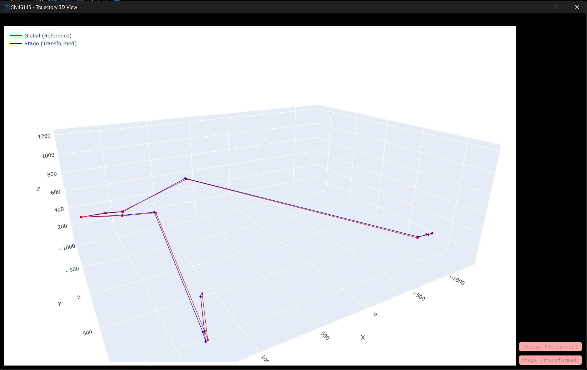

Probe Calibration Trajectory
------------------------------

After a probe calibration is complete, you can open the trajectory view in two ways:

*   Navigate to the main menu and select **Stages > Trajectory**.
*   Click the **View Trajectory** button in the Probe Calibration panel or menubar.

The ``PointMesh`` widget provides an interactive 3D visualization of the probe's trajectory, which is essential for evaluating the quality of a probe calibration.

1. **Overview**

    The widget displays two key trajectories:

    - **Global (Reference)**: These are the ground-truth 3D positions of the probe tip, determined via triangulation from the camera views. This trajectory is shown in **red**.

    - **Stage (Transformed)**: These are the local coordinates from the stage controller, transformed into the global coordinate system using the currently calculated transformation matrix. This trajectory is shown in **blue**.

2. **Using the Widget**

    - **Real-time Updates**: During calibration, the **Stage (Transformed)** trajectory updates in real-time as more data points are collected and the transformation matrix is refined.

    - **Interactive Controls**: You can toggle the visibility of each trajectory using the buttons at the bottom. The plot can be rotated, panned, and zoomed to inspect the alignment from different angles. Hovering over a point will display its precise 3D coordinates.

3. **Evaluating the Results**

    A successful calibration is indicated when the **Stage (Transformed)** trajectory (blue) closely aligns with the **Global (Reference)** trajectory (red). If there are significant deviations, it may indicate that more calibration points are needed or that there were errors during data collection.